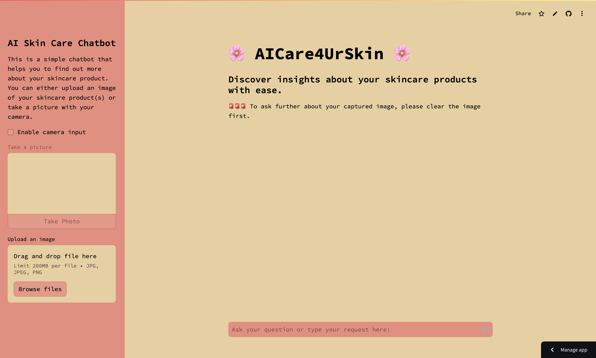
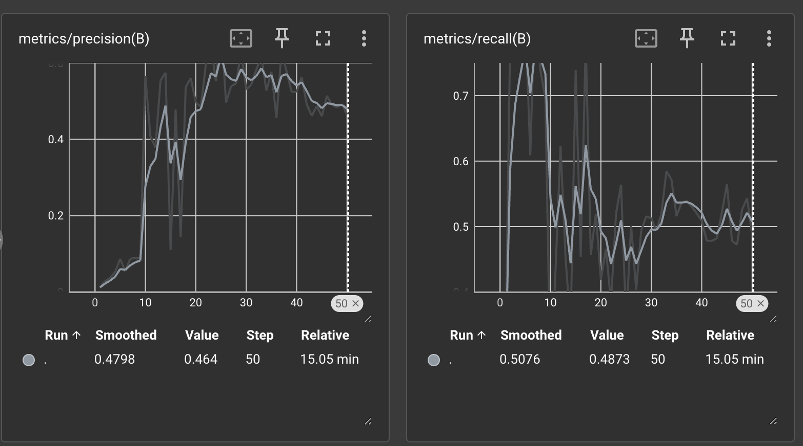
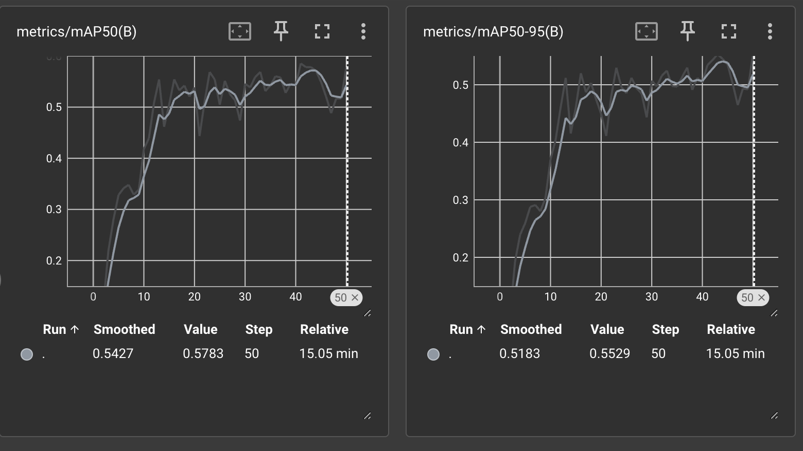

# AICare4UrSkin : Leveraging Computer Vision Object Detection Task with LLM RAG Chatbot

Need help in retrieving information about a specific skincare product on the spot? AiCare4UrSkin is here to help. This application is suitable for those who always found themselves hanging around
Watsons/Guardian longer than they have planned as they are always doing online researches about the products they encountered in the store. In this small project, 
YOLOv11 model is used to train on a custom datasets comprise of skincare products available in Malaysia Drugstore such as Watsons/Guardians. 
Currently, the range of included brands & products are limited to 8 brands/80 classes (80 different products) altogether.
This project utilises Roboflow for image annotation with bounding box, and Langflow for Context Preprocessing for RAG Chatbot. 
For the Chatbot, the model that is used is GPT4-4o-mini, with ChromaDB as vector store and OpenAI's text-embedding-3-small model for the embedding.
Streamlit is utilised for deployment into a final application for integration between the two components. Please note that at the moment, as this project is build under two days,
the performance can not yet be regarded as excellent due to the small datasets.

## Sneak Peek of the App

## Model Performance Metrics using YOLO

## Credits

Datasets:
- https://theraw.com.my
- https://www.theoriginote.com
- https://www.wardahbeauty.com
- https://skintific.com
- https://aiken.com.my
- https://safi.com.my
- https://www.watsons.com.my
- https://guardian.com.my
- Glad2Glow

